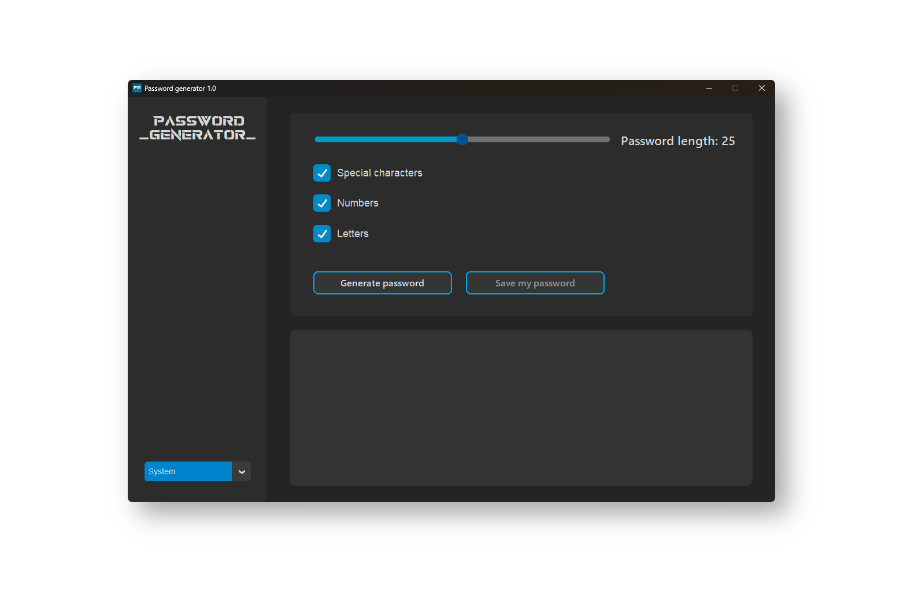
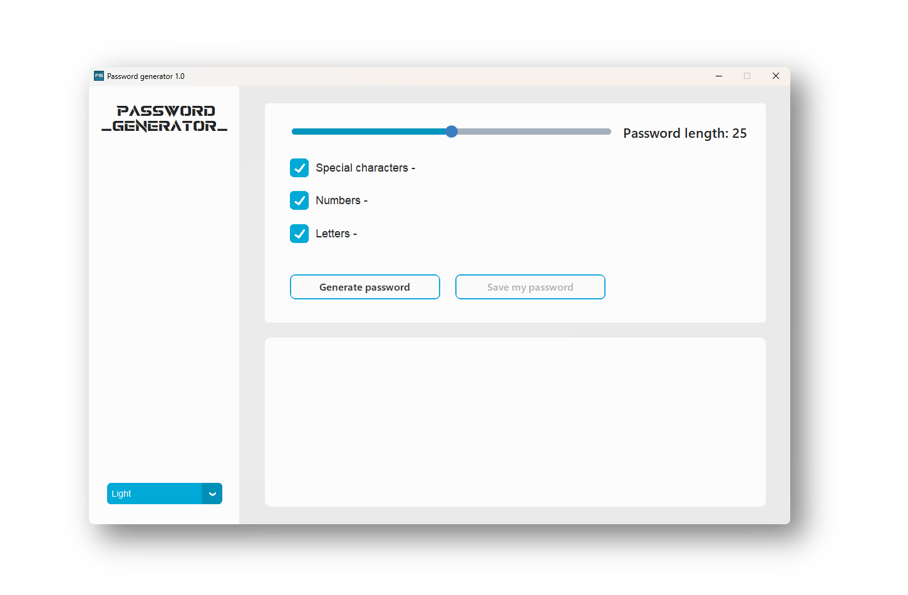

# Password Generator

## Versions 🔧

- 1.2 <
- 1.1 
- 1.0

## What is this project? 🤔

Hi, I’d like to introduce you to Password Generator, a simple Python project using the customtkinter library. It allows you to generate passwords, save them in .txt format, and choose between Dark and Light modes. Additionally, you can check if a password has been compromised in data breaches, and enjoy various interactive features for improved usability.

## Features 1.2 🔥 ✨

- Added a panel on the right side for adjusting text size, clearing the console, and organizing buttons and checkboxes.
- A new feature has been introduced that checks if a password has been compromised in any known data breaches or hacking incidents. This helps you determine whether a password is safe to use or not.
- The Light Mode has been redesigned to be more visually appealing and user-friendly, providing a better overall experience.
- Fixed bugs and enhanced performance.
- The application's color scheme has been refined to enhance visual aesthetics and provide a more pleasing appearance.

## Features 1.1 🌊 ✨

- Optimize the program
- Adding a new function of not displaying the password in the console.
- new features coming soon ;)

## Features 1.0 ✨

- Generate passwords with specified length.
- Choose character types to include in the password (_letters, digits, special characters_).
- Save the generated password to a text file.
- Personalize the color theme (_light, dark, system_).
- Fixed bug with icon.
- Publication of the repository.

## Requirements ⚙️

- Python (version 3.7 or higher)
- customtkinter library ~ 5.2.0
- pyperclip library ~ 1.9.0
- pillow library ~ 9.5.0

## Running the Program with .py 

To run the program, follow these steps:

1. Make sure you have the required version of Python installed and have all the necessary files.
2. Install the customtkinter library by running the command `pip install customtkinter`.
3. Run the `main.py` file.

## License 

This program is provided under the GNU General Public License v3.0. Details can be found in the [LICENSE](https://en.wikipedia.org/wiki/GNU_General_Public_License) wiki page.

## Screenshots

## About the repository

Nice to see you here! 

This is a public repository where I encourage you to comment on my project. I'm not going to lie, this is my first serious project that I have completed for the time being. I am a beginner programmer so please be understanding about the code :) - For example, not using grid placement.

## Author

- Created by: Frankoban Projects
