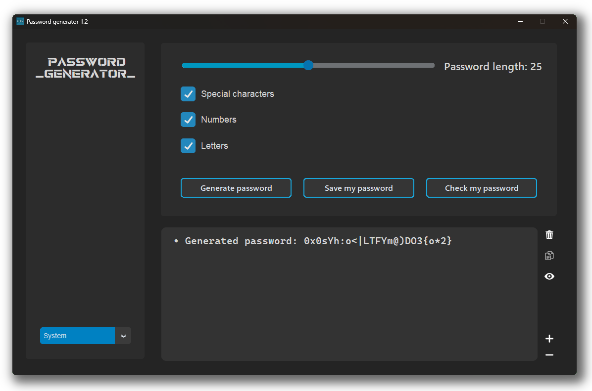
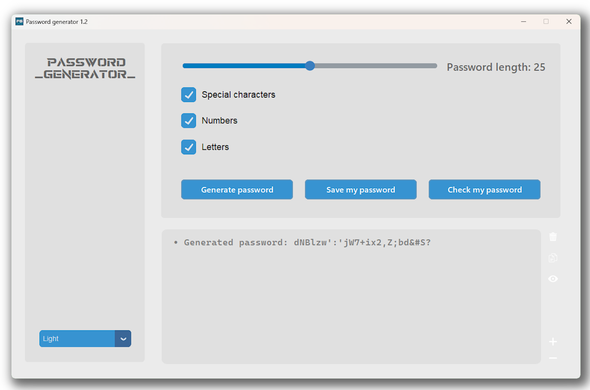

# Password Generator

## Versions 🔧

- 1.1 <
- 1.0

## What is this project? 🤔

Hi, I would like to introduce you to a program called Password Generator. It is a very simple project written in Python which uses customtkinter library. In it you can generate passwords and save them in .txt format. The program is configured for users with different appearance preferences. You will find a Dark mode and a Light mode.

## Features 1.1 🌊 ✨

- Optimize the program
- Adding a new function of not displaying the password in the console.
- new features coming soon ;)

## Features 1.0 ✨

- Generate passwords with specified length.
- Choose character types to include in the password (_letters, digits, special characters_).
- Save the generated password to a text file.
- Personalize the color theme (_light, dark, system_).
- Fixed bug with icon.
- Publication of the repository.

## Requirements ⚙️

- Python (version 3.7 or higher)
- customtkinter library

## Running the Program with .py 

To run the program, follow these steps:

1. Make sure you have the required version of Python installed and have all the necessary files.
2. Install the customtkinter library by running the command `pip install customtkinter`.
3. Run the `main.py` file.

## License 

This program is provided under the GNU General Public License v3.0. Details can be found in the [LICENSE](https://en.wikipedia.org/wiki/GNU_General_Public_License) wiki page.

## Screenshots 

### Dark mode:

### Light mode:

## About the repository

Nice to see you here! 

This is a public repository where I encourage you to comment on my project. I'm not going to lie, this is my first serious project that I have completed for the time being. I am a beginner programmer so please be understanding about the code :)

## Author

- Created by: Frankoban Projects
